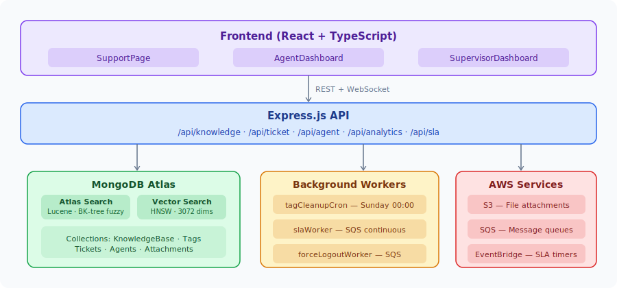
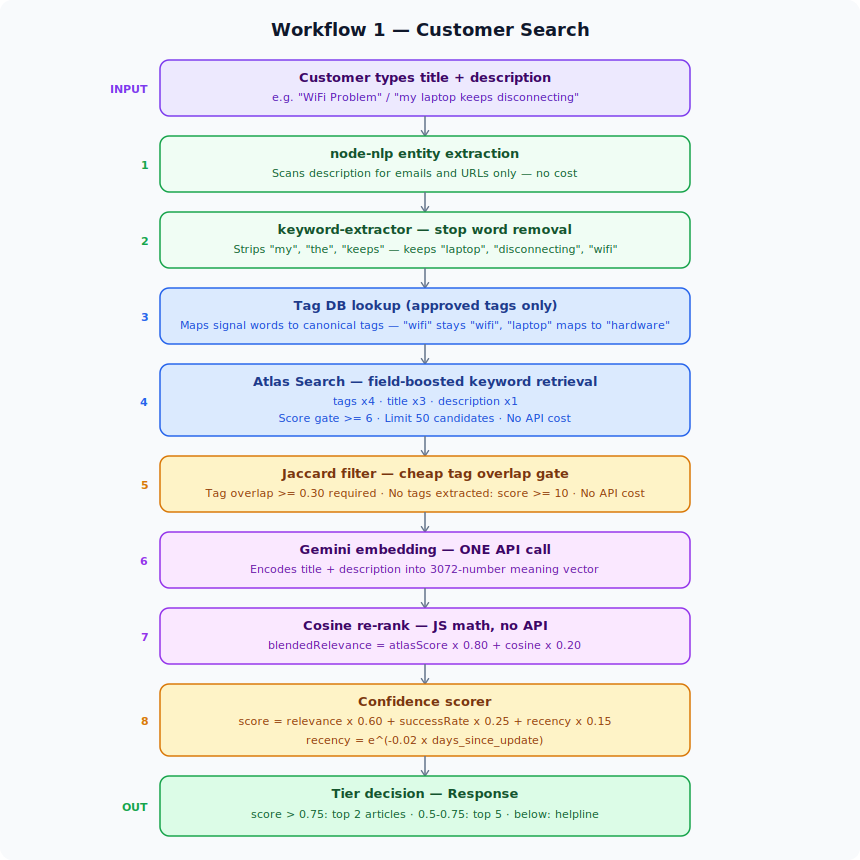
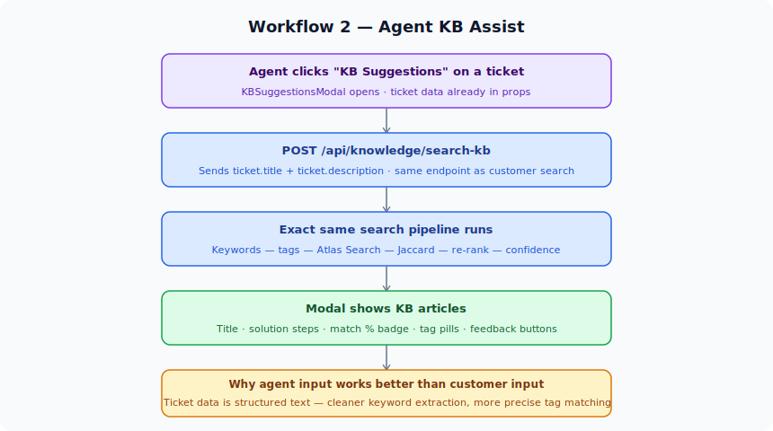
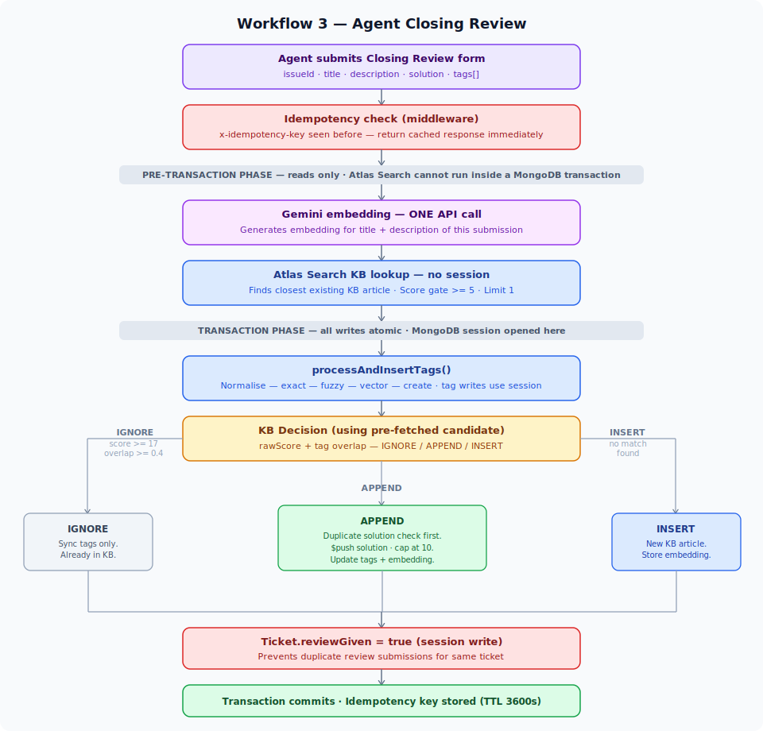
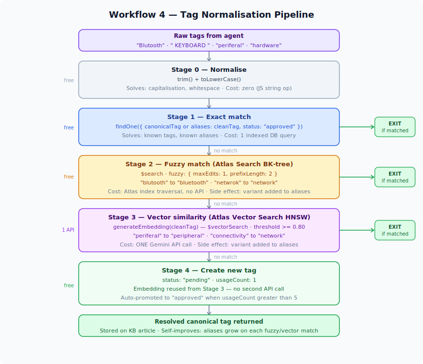
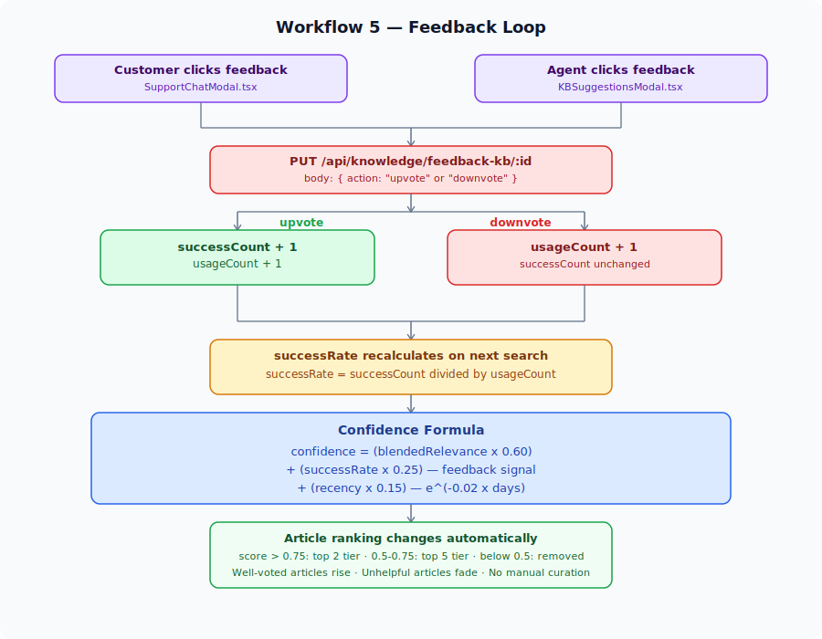
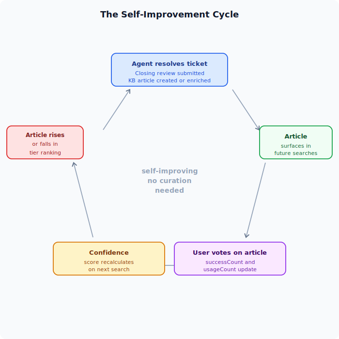
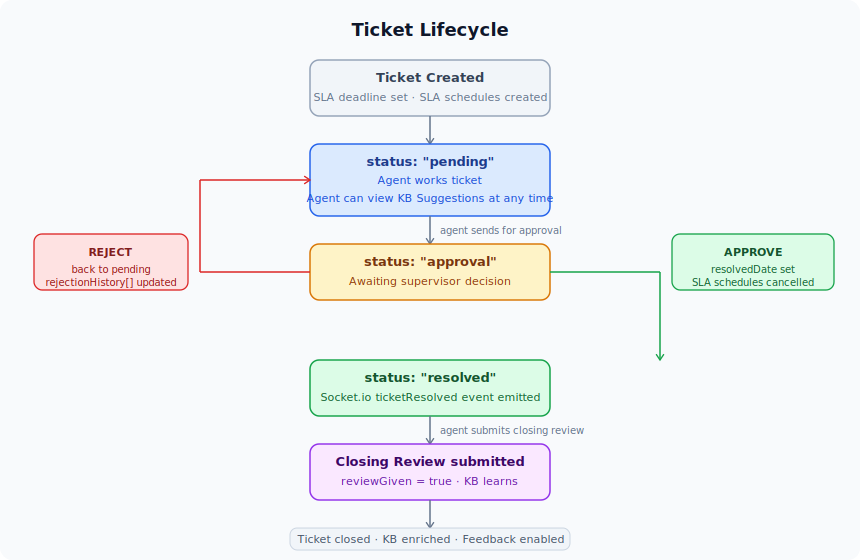

# CogniFlow

> A real-time SaaS support platform with a self-improving knowledge base that gets smarter with every resolved ticket.

---

## The Problem

Support teams at SaaS companies face a compounding problem: the same questions get asked repeatedly, agents spend time solving problems that have already been solved, and institutional knowledge lives in people's heads rather than anywhere searchable. Standard solutions — static FAQ pages, rigid ticketing systems, manual knowledge bases — all suffer from the same flaw: they require constant manual maintenance to stay relevant and they don't learn from the work agents are already doing.

CogniFlow solves this by treating every resolved support ticket as a learning opportunity. When an agent closes a ticket, the solution they wrote automatically flows into a knowledge base. When the next customer describes the same problem, the system surfaces that solution — no manual curation required. The knowledge base improves on its own just by being used.

---

## What CogniFlow Does

CogniFlow is a full-stack support operations platform connecting three roles:

- **Customers** — submit queries through a support chat widget, search for solutions, and give feedback on whether articles helped
- **Agents** — manage tickets through a full lifecycle (pending → approval → resolved), get KB suggestions while on a call, and submit closing reviews that teach the KB
- **Supervisors** — approve or reject agent resolutions, monitor SLA compliance, and view analytics across the team

The knowledge base is the connective tissue. It is populated by agents, searched by customers and agents, refined by feedback, and maintained automatically by background workers.

---

## Tech Stack

| Layer | Technology |
|---|---|
| Frontend | React 19 (TypeScript), Vite, Tailwind CSS, Shadcn/Radix UI |
| Backend | Node.js, Express.js |
| Database | MongoDB Atlas (Mongoose ODM) |
| Search | MongoDB Atlas Search (Lucene), Atlas Vector Search (HNSW) |
| Embeddings | Google Gemini (`gemini-embedding-001`, 3072 dimensions) |
| Auth | Passport.js (JWT strategy), bcrypt |
| Real-time | Socket.io (WebSockets) |
| File storage | AWS S3 |
| Queue / scheduling | AWS SQS, AWS EventBridge |
| Background jobs | node-cron |
| NLP | node-nlp (entity extraction), keyword-extractor (stop word removal) |

---

## Architecture Overview



---

## Knowledge Base — How It Works

The KB system has five distinct workflows. Each diagram below shows exactly what happens step by step.

---

### Workflow 1 — Customer Search

A customer opens the support chat widget, types a title and description, and the system finds the most relevant articles.



**Why this pipeline?** Each stage is cheaper than the last and handles a specific class of problem. Atlas Search handles keyword retrieval for free. Jaccard eliminates wrong-domain articles without an API call. Gemini only fires once, on the smallest possible candidate set, doing the hardest job last — distinguishing meaning within already-relevant results.

---

### Workflow 2 — Agent KB Assist

When an agent opens a ticket, they can click "KB Suggestions" to see relevant articles while on a call with the customer.



**Note:** Agent-side input is structured ticket data (written at ticket creation), so keyword extraction and tag matching tends to be cleaner and more precise than customer free-text input.

---

### Workflow 3 — Agent Closing Review

After a ticket is resolved and approved by a supervisor, the agent submits a closing review. This is the primary mechanism through which the KB learns.



**Why Atlas Search runs outside the transaction:** MongoDB Atlas Search (`$search` and `$vectorSearch`) cannot execute inside a multi-document transaction. All reads happen in a pre-transaction phase. Only standard Mongoose writes (tag saves, KB upserts, ticket update) run inside the session, keeping them atomic.

---

### Workflow 4 — Tag Normalisation Pipeline

Every tag submitted in a closing review passes through a four-stage pipeline before being stored. This ensures the KB never accumulates duplicate, misspelled, or inconsistent tags.



**Key design principle:** Each stage exits early. A well-known tag like `"hardware"` costs one indexed DB query. Only a genuinely new or badly mangled tag ever reaches Gemini. The pipeline also self-improves — every fuzzy or vector match adds the variant to the tag's aliases, so the same variant hits Stage 1 exact match on its next use.

---

### Workflow 5 — Feedback Loop

Every vote on an article changes how that article ranks in every future search.



**The self-improvement cycle:**



No manual curation. No administrator deciding what's relevant. The KB surface is shaped entirely by real usage. Well-voted articles rise. Unhelpful articles fade below the confidence threshold and drop out of results automatically.

---

## Ticket Lifecycle



All ticket state transitions emit real-time Socket.io events to connected clients. Agents see instant notifications for assignments, approvals, rejections, and SLA warnings without polling.

---

## SLA System

Every ticket is assigned a 24-hour SLA deadline at creation. Two AWS EventBridge schedules are set:

- **SLA Warning** — fires before the deadline, emits a `slaWarning` socket event to the agent
- **SLA Breach** — fires at the deadline if unresolved, marks `slaBreached: true`, emits a `slaBreach` socket event

SLA analytics (breach rates, compliance per agent, average resolution time) are available on the supervisor dashboard.

---

## Background Workers

Three workers start automatically when the server boots:

| Worker | Schedule | Purpose |
|---|---|---|
| `tagCleanupCron` | Every Sunday at 00:00 | Deletes pending tags with `usageCount ≤ 5` that are 2+ days old — removes noisy, never-used tags |
| `slaWorker` | Continuous (SQS) | Processes SLA breach and warning events from the AWS SQS queue |
| `forceLogoutWorker` | Continuous (SQS) | Processes force-logout commands from supervisors via SQS |

---

## Project Structure

```
omnisync_2/
├── Backend/
│   ├── controllers/
│   │   ├── knowledgeController.js   # KB search, closing review, feedback
│   │   ├── tagController.js         # Tag normalisation pipeline
│   │   ├── ticketController.js      # Full ticket lifecycle
│   │   ├── agentController.js       # Agent management
│   │   ├── analyticsController.js   # Metrics and monthly data
│   │   └── slaAnalyticsControllers.js
│   ├── models/
│   │   ├── KnowledgeBase.js         # title, description, solution[], tags[], embedding[]
│   │   ├── Tags.js                  # canonicalTag, aliases[], embedding[], status, usageCount
│   │   ├── Tickets.js               # Full ticket schema with history arrays
│   │   └── Agent.js
│   ├── services/
│   │   ├── embedding.js             # Gemini embedding generation + cosine similarity
│   │   ├── confidence.js            # Confidence score formula
│   │   └── tagging.js               # Jaccard similarity
│   ├── worker/
│   │   ├── tagCleanupCron.js        # Weekly noisy tag cleanup
│   │   ├── slaWorker.js             # SQS SLA event processor
│   │   └── forceLogoutWorker.js     # SQS force logout processor
│   ├── middleware/
│   │   ├── authMiddleware.js        # JWT passport authentication
│   │   └── idempotencyMiddleware.js # Idempotency key deduplication
│   ├── routes/                      # Express route definitions
│   ├── config/                      # Passport, S3 config
│   └── index.js                     # Server entry point
│
└── Frontend/
    └── src/
        ├── pages/
        │   ├── SupportPage.tsx          # Customer-facing support + chat widget
        │   ├── AgentDashboard.tsx       # Agent workspace with real-time updates
        │   └── SupervisorDashboard.tsx  # Supervisor oversight and analytics
        └── components/
            ├── support/
            │   └── SupportChatModal.tsx # KB search chat interface
            └── agent/
                ├── KBSuggestionsModal.tsx   # In-ticket KB lookup for agents
                └── ClosingReviewModal.tsx   # Closing review submission form
```

---

## Getting Started

### Prerequisites

- Node.js v18+
- MongoDB Atlas account (Atlas Search and Vector Search indexes required)
- Google Gemini API key
- AWS account (S3, SQS, EventBridge)

### Environment Variables

Create a `.env` file in the `Backend/` directory:

```env
PORT=3000
MONGO_URI=your_mongodb_atlas_connection_string
JWT_SECRET=your_jwt_secret

GEMINI_API_KEY=your_gemini_api_key

AWS_REGION=your_aws_region
AWS_ACCESS_KEY_ID=your_access_key
AWS_SECRET_ACCESS_KEY=your_secret_key
AWS_BUCKET_NAME=your_s3_bucket_name
AWS_SQS_QUEUE_URL=your_sla_sqs_queue_url
AWS_SQS_FORCE_LOGOUT_QUEUE_URL=your_force_logout_sqs_queue_url
```

### Atlas Search Indexes Required

**`knowledgebase_search`** on the `KnowledgeBase` collection:
```json
{
  "mappings": {
    "fields": {
      "title":       [{ "type": "string" }],
      "description": [{ "type": "string" }],
      "tags":        [{ "type": "string" }]
    }
  }
}
```

**`tags_search`** on the `Tags` collection:
```json
{
  "mappings": {
    "fields": {
      "canonicalTag": [{ "type": "string", "analyzer": "lucene.standard" }],
      "aliases":      [{ "type": "string", "analyzer": "lucene.standard" }],
      "status":       [{ "type": "token" }]
    }
  }
}
```

**`tags_vector_index`** on the `Tags` collection:
```json
{
  "fields": [
    { "type": "vector", "path": "embedding", "numDimensions": 3072, "similarity": "cosine" },
    { "type": "filter",  "path": "status" }
  ]
}
```

### Installation

```bash
# Backend
cd Backend
npm install
npx nodemon index.js

# Frontend (separate terminal)
cd Frontend
npm install
npm run dev
```

---

## API Reference

### Knowledge Base

| Method | Endpoint | Auth | Description |
|---|---|---|---|
| `POST` | `/api/knowledge/search-kb` | None | Search KB by title and description |
| `POST` | `/api/knowledge/submit-review` | JWT | Submit closing review after ticket resolution |
| `PUT` | `/api/knowledge/feedback-kb/:id` | None | Upvote or downvote a KB article |
| `GET` | `/api/knowledge/get-kb` | None | Fetch all KB articles |
| `GET` | `/api/knowledge/get-kb/:id` | None | Fetch single KB article |

### Tickets

| Method | Endpoint | Auth | Description |
|---|---|---|---|
| `POST` | `/api/ticket/create` | JWT | Create a new ticket |
| `GET` | `/api/ticket/get` | JWT | Get ticket by issueId |
| `PUT` | `/api/ticket/update` | JWT | Update ticket status |
| `GET` | `/api/ticket/audit-trail/:issueId` | JWT | Full chronological event history |
| `GET` | `/api/ticket/get-paginated-history` | JWT | Paginated ticket history with filters |

### Agents

| Method | Endpoint | Auth | Description |
|---|---|---|---|
| `GET` | `/api/agent/get-agent` | JWT | Get agent by agentId |
| `PUT` | `/api/agent/update` | JWT | Update agent fields |
| `POST` | `/api/agent/update-status` | JWT | Update agent availability status |
| `GET` | `/api/agent/getPaginatedAgents` | JWT | Paginated agent list with live stats |

---

## Real-Time Events (Socket.io)

| Event | Direction | Trigger |
|---|---|---|
| `ticketAssigned` | Server → Client | New ticket assigned to agent |
| `ticketApprovalSent` | Server → Client | Agent sends ticket for approval |
| `ticketResolved` | Server → Client | Supervisor approves ticket |
| `ticketRejected` | Server → Client | Supervisor rejects approval |
| `agentStatusUpdated` | Server → Client | Agent changes availability status |
| `slaWarning` | Server → Client | SLA deadline approaching |
| `slaBreach` | Server → Client | SLA deadline passed |
| `forceLogout` | Server → Client | Supervisor force-logs out agent |
